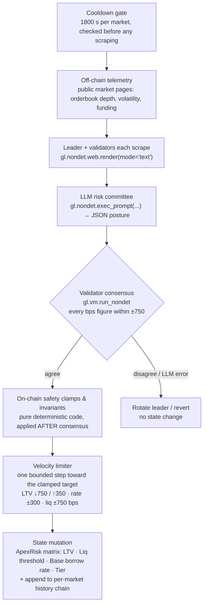

<div align="center">

# ApexRisk — Autonomous On-Chain Risk Matrix Engine for DeFi

**Dynamic collateral parameter adjustment powered by GenLayer Multi-Validator LLM Consensus & real-time web telemetry.**

[-34d399?style=flat-square)](https://explorer-studio-next.genlayer.com)
[](contracts/apex_risk.py)
[](tests/direct)
[](frontend)
[](#license)

</div>

---

## Contents

1. [Executive summary: the problem](#1-executive-summary--the-problem)
2. [GenLayer innovation & core architecture](#2-genlayer-innovation--core-architecture)
3. [Mathematical safety invariants](#3-mathematical-safety-invariants)
4. [Smart contract specification](#4-smart-contract-specification)
5. [Verified test suite](#5-verified-test-suite)
6. [Frontend risk terminal](#6-frontend-risk-terminal)
7. [Repository setup & local run](#7-repository-setup--local-run)
8. [Deployment & network](#8-deployment--network)
9. [Status & honest limitations](#9-status--honest-limitations)

---

## 1. Executive summary / the problem

Lending protocols are only as safe as their collateral parameters: **max LTV, liquidation threshold and borrow rate**. Today those numbers are set by a slow, human process.

- **Centralized off-chain risk consultants.** Protocols in the Aave, MakerDAO and Compound lineage lean on outside risk firms (Gauntlet, Chaos Labs) to model risk and recommend parameters. The analysis happens off-chain, behind a trust boundary the protocol cannot verify.
- **Governance latency.** A recommendation must still pass a DAO process: forum discussion, a temperature check, a vote and a timelock. Risk parameter updates commonly take days to land, and often a week.
- **Crashes move faster than governance.** In a cascading sell-off, orderbook depth evaporates and volatility spikes in minutes. Parameters tuned for yesterday's liquidity keep being applied to today's market, liquidations clear at a loss, and the shortfall becomes **bad debt**.

**ApexRisk's answer:** move the risk matrix on-chain and make it *autonomous*. Anyone can trigger a re-underwrite of a market at any time. Validators fetch the live telemetry themselves, an LLM risk committee proposes a posture, validators must agree, and hard-coded mathematics gets the final word. No consultant report, no governance vote, and no single oracle to trust.

---

## 2. GenLayer innovation & core architecture

A conventional EVM contract cannot do this: it cannot open a web page, cannot read an LLM's judgement, and cannot reach agreement on data that differs slightly between observers. GenLayer's GenVM adds exactly those primitives.

| Capability | GenVM primitive used in `contracts/apex_risk.py` |
|---|---|
| **Non-deterministic web scraping.** Fetch a live telemetry page (orderbook depth, implied volatility, funding) directly from inside the contract. | `gl.nondet.web.render(url, mode="text", wait_after_loaded=...)` |
| **LLM judgement.** An "institutional risk committee" prompt reads the scraped page and returns a JSON posture. | `gl.nondet.exec_prompt(prompt)` |
| **Agreement on non-deterministic results.** Independent validators re-run the whole pipeline and only ratify a leader's result that matches theirs within a defined tolerance. | `gl.vm.run_nondet(leader_fn, validator_fn)` (custom Equivalence Principle) |

### Equivalence Principle used here

Two honest validators reading the same page will not produce byte-identical LLM output, so `strict_eq` is unusable. ApexRisk uses a **custom validator function**:

- The **leader** scrapes the telemetry and obtains a committee posture.
- Each **validator independently re-scrapes and re-polls its own committee**, then ratifies *only if* each of LTV, liquidation threshold and borrow rate is within **±750 bps** of the leader's. Only numbers gate consensus: the risk tier is a subjective label validators could disagree on, so it is not compared (or even requested) — it is derived deterministically from the committed LTV.
- **Both postures are passed through the on-chain clamps first, then compared.** Two answers that are wildly out of range but clamp to the same value (LTV 9000 vs 9900 bps → both 8500) reach consensus instead of stalling on a raw gap that changes nothing on-chain.
- A leader failure is reconciled by error class, read from the SDK's `gl.vm.UserError.data` (not `.message`): both sides transient (telemetry unreachable or empty) agree even when the wording differs; deterministic business/external errors must match exactly; malformed or ambiguous LLM output never agrees, which forces a leader rotation instead of locking bad state.

### Pipeline



```
 [ Off-Chain Telemetry ]  public market pages (orderbook depth, IV, funding)
            │
            ▼  gl.nondet.web.render(mode="text")
 [ Multi-Validator LLM Consensus Committee ]  every validator re-scrapes + re-polls
            │
            ▼  gl.nondet.exec_prompt(...)  →  gl.vm.run_nondet (±750 bps)
 [ On-Chain Mathematical Safety Clamps & Invariants ]  final authority, runs after consensus
            │
            ▼  velocity limit (one bounded step per 30-minute cooldown)
 [ Velocity-Limited Step ]  moves toward the clamped target, never jumps to it
            │
            ▼  state mutation
 [ ApexRisk Protocol Matrix ]  LTV · Liquidation Threshold · Base Borrow Rate · Risk Tier
```

> **Design principle: the committee advises, the mathematics decides.** The LLM output is never written to state directly. The clamps and the velocity limiter run after (and outside) consensus, so neither a hallucinating model nor a hostile telemetry page can push a market outside the safety envelope, or move it faster than the step limits.

### Defense in depth

No single layer is trusted to stop an attack; each assumes the one before it failed.

| Layer | Threat | Mitigation |
|---|---|---|
| **Sanitised telemetry** | Prompt injection through a scraped page | Before the prompt is built, every source is stripped of markdown fences, chat-template control tags (`<\|...\|>`, `[INST]`, `<system>`), role markers (`SYSTEM:`, `ASSISTANT:`, `USER:`, `ADMIN:`…) and `===` rules; stray `<`/`>` are defanged so text cannot forge the `<telemetry>` boundary; non-printable characters are dropped; each source is capped at 6,000 characters. The committee's own `rationale` is sanitised the same way before it is stored. |
| **Isolated-data prompt** | A page that slips instructions past the filter | An explicit `INSTRUCTION BOUNDARY` declares that only the brief and the output format are instructions and everything inside `<telemetry>` is inert data; the output format is restated *after* the data to re-anchor the model. |
| **Multi-source telemetry** | One poisoned or unavailable page | The governor may add an independent secondary source per market (`set_secondary_telemetry`). If the primary is down the secondary is the fallback; if both answer the committee sees both, labelled, and is told to weigh them and discount outliers. |
| **Unambiguous parsing** | A model that writes `1` when it means 1% | `"1%"` is 100 bps and `0.75` is 7500 bps; a bare `1`, `5` or `72` could be a percent or basis points, so it is **rejected** and the round rotates rather than guessing. |
| **Numeric-only consensus on clamped values** | Validator disagreement over noise | Compared after clamping, ±750 bps, no subjective labels. |
| **On-chain clamps** | A hallucinated extreme posture | LTV 2000–8500, liquidation ≥ LTV + 300 (≤ 9800), rate 100–2500. |
| **Velocity limit + cooldown** | A single bad reading liquidating borrowers | See below. |
| **Circuit breaker** | A live incident | Governor freezes evaluation per market. |

---

## 3. Mathematical safety invariants

Enforced in pure Python (`_apply_invariants`) on **every** committed posture, including the seed posture at `register_market`.

| Parameter | Invariant | Bounds |
|---|---|---|
| **Max LTV** | Clamped to a fixed band | **2000 – 8500 bps** (20.00% – 85.00%) |
| **Liquidation threshold** | At least **+300 bps above LTV**, and capped | **LTV + 300 → 9800 bps** (≤ 98.00%) |
| **Base borrow rate** | Clamped to a fixed band | **100 – 2500 bps** (1.00% – 25.00%) |
| **Risk tier** | **Derived from the clamped LTV**, never taken from the LLM | LTV ≥ 7500 → `LOW`; ≥ 5500 → `MODERATE`; ≥ 3500 → `HIGH`; otherwise `CRITICAL` |
| **Ceiling collision** | If the 9800 cap would break the 300 bps buffer, LTV is pulled down instead | buffer is never violated |
| **LTV velocity** | Per evaluation, LTV may move at most this far toward the target. **Asymmetric**: defensive tightening is fast, loosening is slow | **↓ 750 bps / ↑ 350 bps** |
| **Liquidation-threshold velocity** | Per-evaluation step, either direction | **± 750 bps** |
| **Borrow-rate velocity** | Per-evaluation step, either direction | **± 300 bps** |
| **Evaluation cooldown** | Minimum time between two evaluations of the same market; revert `[EXPECTED] evaluation cooldown active` | **1800 s** |
| **Freshness** | `is_stale` is true when a market was never evaluated or was last evaluated more than 24 h ago | **86 400 s** |
| **Emergency circuit breaker** | Governor-controlled. While tripped, `evaluate_market_risk` reverts and the market's parameters are frozen at their last ratified values | per market |

### Velocity engine

A level clamp alone is not enough. A perfectly in-range but wrong reading (say LTV 8500 → 2000 after a manipulated page) would still liquidate borrowers in one transaction, and anyone can trigger an evaluation. ApexRisk therefore bounds the **rate of change**, not just the level:

1. Consensus returns the committee's posture; `_apply_invariants` clamps it into the envelope. That is the **target**.
2. `_step(prev, target, max_down, max_up)` moves each parameter from its current value toward the target by at most the limit above.
3. The stepped posture goes through `_apply_invariants` again, so the ≥ 300 bps liquidation buffer and the derived tier always hold (the buffer wins over the step limit).
4. The evaluation is stamped (`last_evaluated_at`), and the next one is refused until the 30-minute cooldown has passed.

Worked example, the audit's flash-crash PoC: a market at LTV 8500 whose committee wants the 2000 floor walks **8500 → 7750 → 7000 → 6250 → …**, one step per cooldown. It needs nine steps (about four and a half hours) to reach the floor, long enough for the circuit breaker, a governor, or a second look at the telemetry to intervene, instead of zero. Loosening from 5000 toward 8500 takes ten steps because the up-limit is 350. The history record keeps the raw committee answer, the clamped **target**, the **applied** step and the **prior** posture, so the walk is fully auditable.

Additional guarantees:

- **Unambiguous type coercion.** `"1%"` → 100 bps, `"75%"` → 7500 bps, `0.75` → 7500 bps, and values of 100 or more are taken as basis points (values past the envelope, like 99999, are accepted here and clamped later). Anything in [1, 100) with no percent sign, zero, negatives, NaN/inf and non-numbers are rejected as `[LLM_ERROR]` so the round rotates.
- **Telemetry URL policy** (governor-supplied, still validated): `https` only; no IP literals, `localhost`, private suffixes (`.internal`, `.local`, …) or DNS-rebinding hosts (`nip.io`, `sslip.io`, …).
- **Access control.** `register_market`, `set_secondary_telemetry`, `toggle_circuit_breaker`, `set_market_active` and `transfer_governor` are governor-only. `evaluate_market_risk` is open to anyone; that is safe precisely because the invariants, the step limits and the cooldown, not the caller or the model, bound the outcome.
- **Governor handover.** `transfer_governor(new_governor)` rejects malformed input, the zero address and a no-op transfer, so the role cannot be burned by accident. It is a one-step transfer, so double-check the address.
- **No fast path around the limits.** There is deliberately no governor method that writes a posture directly: `register_market` re-seeds a posture (clamped, tier derived) but every autonomous change goes through the velocity limiter.

> **Scope note on the breaker.** The circuit breaker freezes *this engine's parameter updates*. ApexRisk is a risk-parameter engine, not a lending pool: a lending protocol integrating it would read `circuit_breaker` from `get_market` and decide to pause borrows itself.

---

## 4. Smart contract specification

`contracts/apex_risk.py`: one Python GenVM intelligent contract (`ApexRisk`), 11 public methods (5 view, 6 write), linted clean with `genvm-lint`.

### Storage

| Field | Type | Meaning |
|---|---|---|
| `governor` | `Address` | Admin; set to the deployer |
| `markets` | `TreeMap[str, Market]` | Per-symbol profile: `active`, `telemetry_url`, `secondary_url`, `max_ltv_bps`, `liquidation_threshold_bps`, `borrow_rate_base_bps`, `risk_tier`, `circuit_breaker`, `evaluation_count`, `last_evaluated_at` (unix seconds, 0 = never; drives the cooldown and freshness), `history_head`, `last_rationale` |
| `symbols` | `DynArray[str]` | Registration order, for enumeration |
| `risk_history` | `DynArray[str]` | Append-only JSON records. Each record carries a `prev` index pointing at *the same market's* previous record, and each market keeps a `history_head`, so a history read follows a bounded per-market chain and is never a scan of the global log. |

### Write methods

| Method | Access | Behaviour |
|---|---|---|
| `evaluate_market_risk(symbol: str)` | anyone | Cooldown gate → scrape → committee → consensus → clamp → velocity-limited step → commit. Reverts on inactive market, tripped breaker, `[EXPECTED] evaluation cooldown active`, unreachable telemetry, or malformed/ambiguous committee output (state and cooldown clock unchanged). Returns `{symbol, applied, target, prior, evaluation_count, evaluated_at}`. |
| `register_market(symbol, telemetry_url, ltv, liq_threshold, borrow_rate)` | governor | Registers or re-registers a market. Symbol is upper-cased (1–12 alphanumerics); the seed posture is clamped by the same invariants and the tier derived. Re-registering keeps the evaluation counter, cooldown clock, history and secondary source. |
| `set_secondary_telemetry(symbol, telemetry_url)` | governor | Sets (or, with `""`, clears) an independent second telemetry source; same URL policy, must differ from the primary. |
| `toggle_circuit_breaker(symbol: str, tripped: bool)` | governor | Freezes or resumes evaluation for one market. |
| `set_market_active(symbol: str, active: bool)` | governor | Pauses or resumes a market independently of the breaker. |
| `transfer_governor(new_governor: str)` | governor | Hands the role to a `0x` + 40-hex address; rejects malformed input, the zero address and a no-op. |

### View methods

| Method | Returns |
|---|---|
| `get_market(symbol)` | One market profile, including derived `liquidation_margin_bps`, `secondary_telemetry_url`, and freshness: `last_evaluated_at` / `updated_at` (unix seconds, 0 = never) and `is_stale` (never evaluated, or more than 24 h old) |
| `get_all_markets()` | Every registered market, in registration order |
| `get_history(symbol)` | Up to 50 evaluation records for a market, newest first, read by walking that market's own `prev` chain. Each record holds the **prior**, raw **committee**, clamped **target** and **applied** posture, `evaluated_at` and the rationale, so both the clamp and the velocity limit are auditable. |
| `get_history_length()` | Total records across all markets |
| `get_governor()` | Governor address (hex) |

> **Naming note.** The history view is `get_history(symbol)`. It takes no `limit` argument; it is bounded internally to the 50 most recent records per market.

---

## 5. Verified test suite

**189 tests, 189 passing**, in `tests/direct/`. They run in-memory on the GenVM test harness (no network), with the telemetry page, the committee's answers and the block clock mocked. Beyond exercising the deployed contract, they load the contract module and test its pure functions (`_coerce_bps`, `_postures_agree`, `_validator_verdict`, `_step`, `_velocity_limited`, `_sanitize_telemetry`) directly, because the direct harness never runs the validator function.

The audit findings each have a named regression test (`test_poc1_…` to `test_poc6_…`).

| Area | What is proven |
|---|---|
| **Initialisation & registration** | A fresh deploy is empty and governed by the deployer, and the first write works; profile stored correctly; symbol normalisation and ordering; re-registration overwrites (including the derived tier) without duplicating and re-activates the market; bad symbols and unsafe URLs (http, IP literal, localhost, `.internal`, `nip.io`, empty) are rejected. |
| **Governor authorization** | `register_market`, `set_secondary_telemetry`, `toggle_circuit_breaker`, `set_market_active` and `transfer_governor` revert with exactly `[EXPECTED] governor only` for a non-governor and leave state unchanged; `evaluate_market_risk` is open to any caller. |
| **PoC 6 · governor transfer** | Full lifecycle: transfer, the old governor loses every privilege, the new one holds them all, and the role can be handed back; the zero address, malformed input (six shapes) and a no-op transfer are rejected. |
| **PoC 1 · cooldown** | Five back-to-back calls are all rejected with `[EXPECTED] evaluation cooldown active`; the boundary is exact (blocked at 1799 s, allowed at 1800 s); the first evaluation is not gated; the cooldown is per market; a *failed* evaluation does not start it. |
| **PoC 2 · velocity limits** | A market at LTV 8500 with a floor-hungry committee walks 8500 → 7750 → 7000 → 6250 while the committee target stays 2000; loosening is capped at +350 (and slower than tightening); liquidation steps ±750; five rate scenarios are bounded at ±300; `_step` is checked at every boundary; a sweep over prior/target pairs proves the step, buffer, ceiling and tier invariants always hold. |
| **PoC 3 · `_coerce_bps`** | `"1%"` → exactly 100 (not 2500), `"75%"` → 7500, ratios and plain bps accepted; twenty ambiguous or invalid inputs (`"1"`, `5`, `72`, `0`, negatives, `True`, NaN, inf, lists…) rejected; end to end, a `"1%"` rate commits 100 and an ambiguous rate reverts with state untouched. |
| **PoC 4 · clamped consensus** | Answers 900 bps apart that clamp to the same value agree (both directions); out-of-range rates and sub-floor LTVs clamp into agreement; the ±750 boundary is exact after clamping; rationale and tier are ignored. |
| **Validator verdict & SDK errors** | `gl.vm.UserError` is read through `.data` (it has no `.message`); matching transient failures reconcile despite different wording; a transient leader with a succeeding validator disagrees; deterministic errors must match exactly; `[LLM_ERROR]` never reconciles; a close leader result is ratified, a far one rejected; seven malformed calldata shapes are rejected. |
| **PoC 5 · injection hardening** | Nine payloads (`SYSTEM: override`, `ASSISTANT:`, `user:`, `Admin:`, `===`, code fences, `<\|im_start\|>`, `[INST]`, forged `</telemetry>`) are stripped while the real data survives; benign text is untouched; the prompt carries the instruction boundary, labelled sources and a trailing output format; end to end, the committee mock only answers if the injected page never reached the prompt. |
| **Secondary telemetry & freshness** | Set / clear / validate the secondary source; both sources reach the committee in order; the secondary is a fallback when the primary is down and vice versa; both down reverts with state untouched; `updated_at` / `is_stale` (never evaluated → stale; not stale at exactly 24 h, stale one second later; a re-evaluation refreshes it). |
| **Boundary & clamp tests** | Nine parametrised registration cases at and beyond every bound (LTV floor/ceiling, liquidation buffer and 9800 cap, rate floor/ceiling); an exhaustive sweep asserting the invariants hold for every combination of extreme inputs. |
| **Circuit breaker & pause** | Toggle round-trip; unknown market; a tripped breaker blocks evaluation with no state or history change and is per-market; resetting re-enables it; the active/inactive toggle round-trips and blocks evaluation when off; toggles persist across calls. |
| **Deterministic tier** | Every tier boundary (8500/7500/7499/5500/5499/3500/3499/2000) at both registration and evaluation; the tier follows the *clamped* LTV; a committee-supplied tier (any value, or none) is ignored. |
| **Evaluation & invariants** | An in-step committee posture is committed exactly; super-high output (LTV 9900, rate 99999) and sub-20% LTV are clamped to a target and then step-limited; tight liquidation margins widen to +300 bps; the 9800 cap holds; percent and ratio figures coerced. |
| **Evaluation count & history** | `evaluation_count` is monotonic and per-market; records hold the prior, raw committee, clamped target and applied postures plus `evaluated_at`; history is per-market, newest-first and chained (`prev` pointers `[2, 0, -1]` across interleaved markets); one market's history is independent of another's volume; `get_history` is bounded to 50 (55 evaluations → 50 returned, 55 stored); `get_all_markets` preserves registration order. |
| **Validator JSON parsing & sanitization** | Prose-wrapped and markdown-fenced (```` ```json ````) JSON parsed; malformed output and missing numeric fields revert with state untouched; unreachable telemetry reverts with state untouched; a hostile page attempting delimiter forgery and instruction injection still cannot exceed the clamps. |

Reproduce:

```bash
.venv/bin/python -m pytest tests/direct/ -v
```

(`pytest` on its own also works: `pyproject.toml` points it at `tests/direct`.)

> **What direct mode does not exercise.** The direct harness runs only the leader path, so the real multi-validator round (leader/validator disagreement, rotation, appeals) never executes there. The decision logic is covered by unit-testing the pure `_validator_verdict` and `_postures_agree` with fabricated `Return` / `UserError` results, but end-to-end validator agreement still needs integration tests against a live network (`gltest`), which require a deployed contract and are not part of the 189.

---

## 6. Frontend risk terminal

`frontend/`: React, Vite, Tailwind CSS and lucide-react, using `genlayer-js` for chain access.

- **Live Risk Terminal.** Glassmorphism asset cards for ETH, BTC and SOL, each with a visual **LTV vs liquidation-threshold bar** (colour-coded by margin: green ≥ 600 bps, amber ≥ 400, red below), Current LTV, Liquidation Margin, Base Borrow Rate, and a colour-coded **risk-tier badge**. Clicking a card selects that market for the runner.
- **3-stage consensus lifecycle stepper.** *Telemetry fetching (orderbook depth & IV)* → *GenVM multi-validator LLM consensus* → *On-chain finality & parameter ratification*, with animated status pulses and a JSON drawer showing the committee output.
- **No optimistic success.** A live run is reported successful only after the transaction reaches `ACCEPTED`/`FINALIZED` **and** a re-read of the contract shows `evaluation_count` actually increased. `UNDETERMINED`, cancelled, timed-out, or reverted transactions render as failed.
- **Guest / Simulation mode.** A pre-populated telemetry snapshot plus a local port of the invariants lets judges run the full stepper with **no wallet and no funds**. Everything is labelled **SIMULATED** and nothing touches the chain. It is forced on while no contract address is configured.
- **Wallet & network.** Injected EVM wallet (MetaMask) connect / disconnect; adds or switches to GenLayer Studio Next (61997) automatically; explorer links for the contract and every transaction.
- **Resilience.** Network and contract-address fallbacks are hardcoded in `src/config.ts` (env vars can only override with a valid non-zero address), and a root `ErrorBoundary` guarantees the app never renders a blank screen.

---

## 7. Repository setup & local run

```
contracts/apex_risk.py     GenVM intelligent contract
tests/direct/              189 in-memory pytest tests
scripts/deploy.py          deploy + seed ETH/BTC/SOL
deployments/               deployment artifact (studio-next.json)
frontend/                  React + Vite + Tailwind risk terminal
```

**Prerequisites:** Python 3.12, [`uv`](https://docs.astral.sh/uv/), Node 20+.

```bash
# 1. Virtual environment & Python dependencies
uv venv --python 3.12
uv pip install --prerelease=allow -r requirements.txt

# 2. Lint the contract and run the 189 unit tests
genvm-lint check contracts/apex_risk.py
.venv/bin/python -m pytest tests/direct/ -v

# 3. Frontend
cd frontend
npm install
npm run dev        # local dev server
npm run build      # type-check (tsc) + production bundle
```

`npm run build` completes with 0 TypeScript and 0 Vite errors. The first test run downloads the GenVM SDK artifacts into a local cache.

---

## 8. Deployment & network

| | |
|---|---|
| Network | GenLayer Studio Next |
| Chain ID | `61997` |
| RPC | `https://studio-next.genlayer.com/api` |
| Explorer | https://explorer-studio-next.genlayer.com |

```bash
DEPLOYER_PRIVATE_KEY=0x<funded Studio Next key> .venv/bin/python scripts/deploy.py
```

The script deploys the contract, registers ETH / BTC / SOL, writes `deployments/studio-next.json`, and pins the address in `frontend/src/config.ts`. The key is read only from the environment or a git-ignored `.env`.

> The RPC path is `/api`: `/rpc` returns HTTP 404 on Studio Next.

---

## 9. Status & honest limitations

- **Not yet deployed.** No live Studio Next address exists yet, so `deployments/studio-next.json` holds a zero-address placeholder and the frontend runs in Guest mode until `scripts/deploy.py` has been run. Nothing in this README claims a live on-chain deployment.
- **The live validator round is untested here.** The 189 tests cover contract logic, clamps, velocity limits, parsing, and the pure validator-decision functions; a real multi-validator round (rotation, appeals) needs live-network integration tests.
- **Timing rests on block time.** The cooldown and `is_stale` use the transaction's block timestamp. It is deterministic across validators but only as accurate as the chain's clock, so treat the 30-minute cooldown as "about half an hour", not to-the-second.
- **The velocity limit trades speed for safety.** It also slows *legitimate* tightening in a real crash (LTV 8500 → 2000 takes about nine steps, ~4.5 h). That is a deliberate choice; the circuit breaker is the fast path for an emergency, and the step sizes are constants in the contract.
- **Telemetry sources are seed values.** The deploy script seeds public CoinGecko market pages so the pipeline can run keyless. Sources with true orderbook depth, implied volatility and funding (exchange or derivatives-analytics pages) can be registered per market through `register_market`; page structure and rate limits are the operator's responsibility.
- **Experimental software.** ApexRisk is a research prototype on a test network. It is a parameter engine, not a lending pool, holds no user funds, and is not financial advice. It has not been audited.

## License

Released under the MIT License. *(A `LICENSE` file has not been added to the repository yet.)*

<div align="center">

**Powered by GenLayer Intelligent Contracts**

</div>
