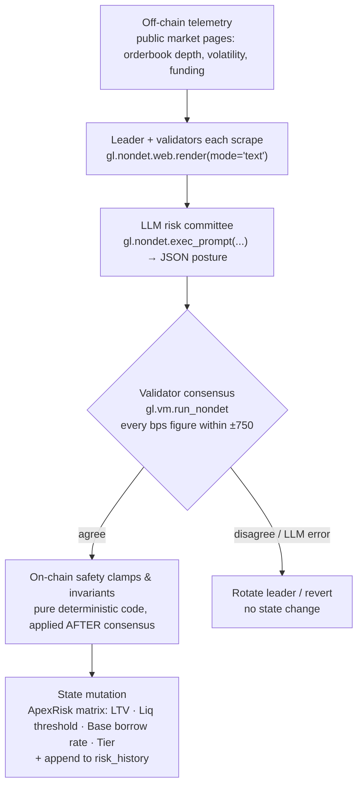

<div align="center">

# ApexRisk — Autonomous On-Chain Risk Matrix Engine for DeFi

**Dynamic collateral parameter adjustment powered by GenLayer Multi-Validator LLM Consensus & real-time web telemetry.**

[-34d399?style=flat-square)](https://explorer-studio-next.genlayer.com)
[](contracts/apex_risk.py)
[](tests/direct)
[](frontend)
[](#license)

</div>

---

## Contents

1. [Executive summary: the problem](#1-executive-summary--the-problem)
2. [GenLayer innovation & core architecture](#2-genlayer-innovation--core-architecture)
3. [Mathematical safety invariants](#3-mathematical-safety-invariants)
4. [Smart contract specification](#4-smart-contract-specification)
5. [Verified test suite](#5-verified-test-suite)
6. [Frontend risk terminal](#6-frontend-risk-terminal)
7. [Repository setup & local run](#7-repository-setup--local-run)
8. [Deployment & network](#8-deployment--network)
9. [Status & honest limitations](#9-status--honest-limitations)

---

## 1. Executive summary / the problem

Lending protocols are only as safe as their collateral parameters: **max LTV, liquidation threshold and borrow rate**. Today those numbers are set by a slow, human process.

- **Centralized off-chain risk consultants.** Protocols in the Aave, MakerDAO and Compound lineage lean on outside risk firms (Gauntlet, Chaos Labs) to model risk and recommend parameters. The analysis happens off-chain, behind a trust boundary the protocol cannot verify.
- **Governance latency.** A recommendation must still pass a DAO process: forum discussion, a temperature check, a vote and a timelock. Risk parameter updates commonly take days to land, and often a week.
- **Crashes move faster than governance.** In a cascading sell-off, orderbook depth evaporates and volatility spikes in minutes. Parameters tuned for yesterday's liquidity keep being applied to today's market, liquidations clear at a loss, and the shortfall becomes **bad debt**.

**ApexRisk's answer:** move the risk matrix on-chain and make it *autonomous*. Anyone can trigger a re-underwrite of a market at any time. Validators fetch the live telemetry themselves, an LLM risk committee proposes a posture, validators must agree, and hard-coded mathematics gets the final word. No consultant report, no governance vote, and no single oracle to trust.

---

## 2. GenLayer innovation & core architecture

A conventional EVM contract cannot do this: it cannot open a web page, cannot read an LLM's judgement, and cannot reach agreement on data that differs slightly between observers. GenLayer's GenVM adds exactly those primitives.

| Capability | GenVM primitive used in `contracts/apex_risk.py` |
|---|---|
| **Non-deterministic web scraping.** Fetch a live telemetry page (orderbook depth, implied volatility, funding) directly from inside the contract. | `gl.nondet.web.render(url, mode="text", wait_after_loaded=...)` |
| **LLM judgement.** An "institutional risk committee" prompt reads the scraped page and returns a JSON posture. | `gl.nondet.exec_prompt(prompt)` |
| **Agreement on non-deterministic results.** Independent validators re-run the whole pipeline and only ratify a leader's result that matches theirs within a defined tolerance. | `gl.vm.run_nondet(leader_fn, validator_fn)` (custom Equivalence Principle) |

### Equivalence Principle used here

Two honest validators reading the same page will not produce byte-identical LLM output, so `strict_eq` is unusable. ApexRisk uses a **custom validator function**:

- The **leader** scrapes the telemetry and obtains a committee posture.
- Each **validator independently re-scrapes and re-polls its own committee**, then ratifies *only if* each of LTV, liquidation threshold and borrow rate is within **±750 bps** of the leader's. Only numbers gate consensus: the risk tier is a subjective label validators could disagree on, so it is not compared (or even requested) — it is derived deterministically from the clamped LTV after consensus.
- A leader failure is reconciled by error class: both sides transient (telemetry unreachable) agree; deterministic business errors must match exactly; malformed LLM output never agrees, which forces a leader rotation instead of locking bad state.

### Pipeline



```
 [ Off-Chain Telemetry ]  public market pages (orderbook depth, IV, funding)
            │
            ▼  gl.nondet.web.render(mode="text")
 [ Multi-Validator LLM Consensus Committee ]  every validator re-scrapes + re-polls
            │
            ▼  gl.nondet.exec_prompt(...)  →  gl.vm.run_nondet (±750 bps)
 [ On-Chain Mathematical Safety Clamps & Invariants ]  final authority, runs after consensus
            │
            ▼  state mutation
 [ ApexRisk Protocol Matrix ]  LTV · Liquidation Threshold · Base Borrow Rate · Risk Tier
```

> **Design principle: the committee advises, the mathematics decides.** The LLM output is never written to state directly. The clamps run after (and outside) consensus, so neither a hallucinating model nor a hostile telemetry page can push a market outside the safety envelope.

**Prompt-injection hardening.** Scraped text is untrusted. It is stripped of non-printable characters, has `<` and `>` neutralised (so it cannot forge the `<telemetry>` delimiter), and is truncated to 6,000 characters before it reaches the model.

---

## 3. Mathematical safety invariants

Enforced in pure Python (`_apply_invariants`) on **every** committed posture, including the seed posture at `register_market`.

| Parameter | Invariant | Bounds |
|---|---|---|
| **Max LTV** | Clamped to a fixed band | **2000 – 8500 bps** (20.00% – 85.00%) |
| **Liquidation threshold** | At least **+300 bps above LTV**, and capped | **LTV + 300 → 9800 bps** (≤ 98.00%) |
| **Base borrow rate** | Clamped to a fixed band | **100 – 2500 bps** (1.00% – 25.00%) |
| **Risk tier** | **Derived from the clamped LTV**, never taken from the LLM | LTV ≥ 7500 → `LOW`; ≥ 5500 → `MODERATE`; ≥ 3500 → `HIGH`; otherwise `CRITICAL` |
| **Ceiling collision** | If the 9800 cap would break the 300 bps buffer, LTV is pulled down instead | buffer is never violated |
| **Emergency circuit breaker** | Governor-controlled. While tripped, `evaluate_market_risk` reverts and the market's parameters are frozen at their last ratified values | per market |

Additional guarantees:

- **Type coercion.** The committee's numbers are coerced defensively: `0.75` is read as 7500 bps, `"72%"` as 7200 bps, and unusable values are rejected as `[LLM_ERROR]`.
- **Telemetry URL policy** (governor-supplied, still validated): `https` only; no IP literals, `localhost`, private suffixes (`.internal`, `.local`, …) or DNS-rebinding hosts (`nip.io`, `sslip.io`, …).
- **Access control.** `register_market`, `toggle_circuit_breaker` and `set_market_active` are governor-only. `evaluate_market_risk` is open to anyone; that is safe precisely because the invariants, not the caller or the model, bound the outcome.

> **Scope note on the breaker.** The circuit breaker freezes *this engine's parameter updates*. ApexRisk is a risk-parameter engine, not a lending pool: a lending protocol integrating it would read `circuit_breaker` from `get_market` and decide to pause borrows itself.

---

## 4. Smart contract specification

`contracts/apex_risk.py`: one Python GenVM intelligent contract (`ApexRisk`), 9 public methods (5 view, 4 write), linted clean with `genvm-lint`.

### Storage

| Field | Type | Meaning |
|---|---|---|
| `governor` | `Address` | Admin; set to the deployer |
| `markets` | `TreeMap[str, Market]` | Per-symbol profile: `active`, `telemetry_url`, `max_ltv_bps`, `liquidation_threshold_bps`, `borrow_rate_base_bps`, `risk_tier`, `circuit_breaker`, `evaluation_count`, `last_rationale` (no wall-clock is stored; `evaluation_count` is the monotonic sequence) |
| `symbols` | `DynArray[str]` | Registration order, for enumeration |
| `risk_history` | `DynArray[str]` | Append-only JSON records of every evaluation |

### Write methods

| Method | Access | Behaviour |
|---|---|---|
| `evaluate_market_risk(symbol: str)` | anyone | Scrape → committee → consensus → clamp → commit. Reverts on inactive market, tripped breaker, unreachable telemetry, or malformed committee output (state unchanged). Returns `{symbol, applied, prior, evaluation_count, evaluated_at}`. |
| `register_market(symbol, telemetry_url, ltv, liq_threshold, borrow_rate)` | governor | Registers or re-registers a market. Symbol is upper-cased (1–12 alphanumerics); the seed posture is clamped by the same invariants. |
| `toggle_circuit_breaker(symbol: str, tripped: bool)` | governor | Freezes or resumes evaluation for one market. |
| `set_market_active(symbol: str, active: bool)` | governor | Pauses or resumes a market independently of the breaker. |

### View methods

| Method | Returns |
|---|---|
| `get_market(symbol)` | One market profile, including derived `liquidation_margin_bps` |
| `get_all_markets()` | Every registered market, in registration order |
| `get_history(symbol)` | Up to 50 evaluation records for a market, newest first. Each record holds the **prior**, **committee** and **applied** posture plus the rationale, so the effect of the clamps is auditable. |
| `get_history_length()` | Total records across all markets |
| `get_governor()` | Governor address (hex) |

> **Naming note.** The history view is `get_history(symbol)`. It takes no `limit` argument; it is bounded internally to the 50 most recent records per market.

---

## 5. Verified test suite

**80 tests, 80 passing**, in `tests/direct/`. They run in-memory on the GenVM test harness (no network), with the telemetry page and committee answers mocked.

| Area | What is proven |
|---|---|
| **Initialisation & registration** | A fresh deploy is empty and governed by the deployer, and the first write works; profile stored correctly; symbol normalisation and ordering; re-registration overwrites (including the derived tier) without duplicating and re-activates the market; bad symbols and unsafe URLs (http, IP literal, localhost, `.internal`, `nip.io`, empty) are rejected. |
| **Governor authorization** | `register_market`, `toggle_circuit_breaker` and `set_market_active` revert with exactly `[EXPECTED] governor only` for a non-governor and leave state unchanged; `evaluate_market_risk` is open to any caller. |
| **Boundary & clamp tests** | Nine parametrised registration cases at and beyond every bound (LTV floor/ceiling, liquidation buffer and 9800 cap, rate floor/ceiling); an exhaustive sweep asserting the invariants hold for every combination of extreme inputs. |
| **Circuit breaker & pause** | Toggle round-trip; unknown market; a tripped breaker blocks evaluation with no state or history change and is per-market; resetting re-enables it; the active/inactive toggle round-trips and blocks evaluation when off; toggles persist across calls. |
| **Deterministic tier** | Every tier boundary (8500/7500/7499/5500/5499/3500/3499/2000) at both registration and evaluation; the tier follows the *clamped* LTV; a committee-supplied tier (any value, or none) is ignored. |
| **Evaluation & invariants** | Committee posture is committed; super-high output (LTV 9900, rate 99999) and sub-20% LTV are clamped; tight liquidation margins widen to +300 bps; the 9800 cap holds; fractional and percent figures coerced. |
| **Evaluation count & history** | `evaluation_count` is monotonic and per-market; records hold prior / committee / applied postures and no timestamp; history is per-market and newest-first; `get_history` is bounded to 50 (55 evaluations → 50 returned, 55 stored); `get_all_markets` preserves registration order. |
| **Validator JSON parsing & sanitization** | Prose-wrapped and markdown-fenced (```` ```json ````) JSON parsed; malformed output and missing numeric fields revert with state untouched; unreachable telemetry reverts with state untouched; a hostile page attempting delimiter forgery and instruction injection still cannot exceed the clamps. |

Reproduce:

```bash
.venv/bin/python -m pytest tests/direct/ -v
```

(`pytest` on its own also works: `pyproject.toml` points it at `tests/direct`.)

> **What direct mode does not exercise.** The direct harness runs the leader path; the validator comparison function (`validator_fn`) is **not** executed there. Validator agreement is meant to be covered by integration tests against a live network (`gltest`), which require a deployed contract and are not part of the 80.

---

## 6. Frontend risk terminal

`frontend/`: React, Vite, Tailwind CSS and lucide-react, using `genlayer-js` for chain access.

- **Live Risk Terminal.** Glassmorphism asset cards for ETH, BTC and SOL, each with a visual **LTV vs liquidation-threshold bar** (colour-coded by margin: green ≥ 600 bps, amber ≥ 400, red below), Current LTV, Liquidation Margin, Base Borrow Rate, and a colour-coded **risk-tier badge**. Clicking a card selects that market for the runner.
- **3-stage consensus lifecycle stepper.** *Telemetry fetching (orderbook depth & IV)* → *GenVM multi-validator LLM consensus* → *On-chain finality & parameter ratification*, with animated status pulses and a JSON drawer showing the committee output.
- **No optimistic success.** A live run is reported successful only after the transaction reaches `ACCEPTED`/`FINALIZED` **and** a re-read of the contract shows `evaluation_count` actually increased. `UNDETERMINED`, cancelled, timed-out, or reverted transactions render as failed.
- **Guest / Simulation mode.** A pre-populated telemetry snapshot plus a local port of the invariants lets judges run the full stepper with **no wallet and no funds**. Everything is labelled **SIMULATED** and nothing touches the chain. It is forced on while no contract address is configured.
- **Wallet & network.** Injected EVM wallet (MetaMask) connect / disconnect; adds or switches to GenLayer Studio Next (61997) automatically; explorer links for the contract and every transaction.
- **Resilience.** Network and contract-address fallbacks are hardcoded in `src/config.ts` (env vars can only override with a valid non-zero address), and a root `ErrorBoundary` guarantees the app never renders a blank screen.

---

## 7. Repository setup & local run

```
contracts/apex_risk.py     GenVM intelligent contract
tests/direct/              80 in-memory pytest tests
scripts/deploy.py          deploy + seed ETH/BTC/SOL
deployments/               deployment artifact (studio-next.json)
frontend/                  React + Vite + Tailwind risk terminal
```

**Prerequisites:** Python 3.12, [`uv`](https://docs.astral.sh/uv/), Node 20+.

```bash
# 1. Virtual environment & Python dependencies
uv venv --python 3.12
uv pip install --prerelease=allow -r requirements.txt

# 2. Lint the contract and run the 80 unit tests
genvm-lint check contracts/apex_risk.py
.venv/bin/python -m pytest tests/direct/ -v

# 3. Frontend
cd frontend
npm install
npm run dev        # local dev server
npm run build      # type-check (tsc) + production bundle
```

`npm run build` completes with 0 TypeScript and 0 Vite errors. The first test run downloads the GenVM SDK artifacts into a local cache.

---

## 8. Deployment & network

| | |
|---|---|
| Network | GenLayer Studio Next |
| Chain ID | `61997` |
| RPC | `https://studio-next.genlayer.com/api` |
| Explorer | https://explorer-studio-next.genlayer.com |

```bash
DEPLOYER_PRIVATE_KEY=0x<funded Studio Next key> .venv/bin/python scripts/deploy.py
```

The script deploys the contract, registers ETH / BTC / SOL, writes `deployments/studio-next.json`, and pins the address in `frontend/src/config.ts`. The key is read only from the environment or a git-ignored `.env`.

> The RPC path is `/api`: `/rpc` returns HTTP 404 on Studio Next.

---

## 9. Status & honest limitations

- **Not yet deployed.** No live Studio Next address exists yet, so `deployments/studio-next.json` holds a zero-address placeholder and the frontend runs in Guest mode until `scripts/deploy.py` has been run. Nothing in this README claims a live on-chain deployment.
- **Validator logic is untested here.** The 80 tests validate contract logic, clamps and parsing; the multi-validator agreement path needs live-network integration tests.
- **Telemetry sources are seed values.** The deploy script seeds public CoinGecko market pages so the pipeline can run keyless. Sources with true orderbook depth, implied volatility and funding (exchange or derivatives-analytics pages) can be registered per market through `register_market`; page structure and rate limits are the operator's responsibility.
- **Experimental software.** ApexRisk is a research prototype on a test network. It is a parameter engine, not a lending pool, holds no user funds, and is not financial advice. It has not been audited.

## License

Released under the MIT License. *(A `LICENSE` file has not been added to the repository yet.)*

<div align="center">

**Powered by GenLayer Intelligent Contracts**

</div>
